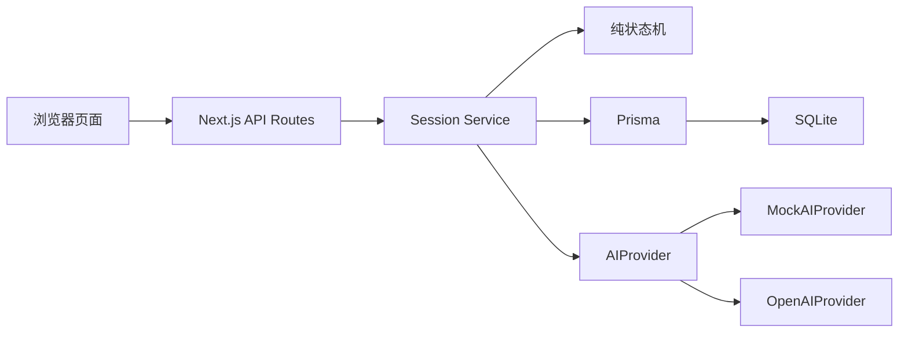
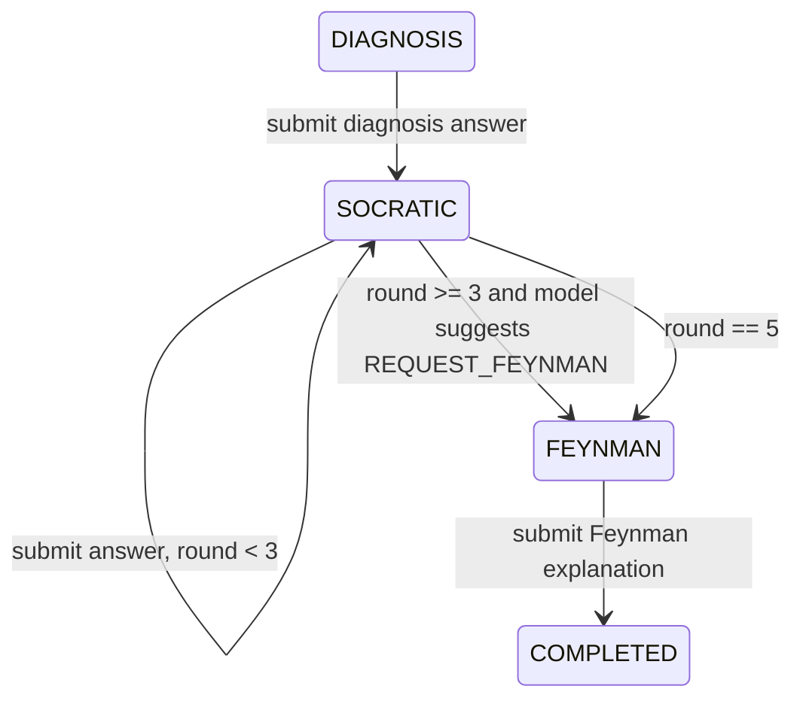

# ThinkTutor 架构说明

## 总览

ThinkTutor 是一个单体 Next.js App Router 应用。页面、API Routes、Prisma 数据访问和 AI Provider 位于同一仓库，避免为 MVP 引入独立后端。

## 数据流

1. 学生在 `/task/new` 创建任务。
2. `POST /api/sessions` 校验输入，调用 AI Provider 生成诊断问题，写入 `LearningSession` 和初始 `Message`。
3. `/session/[sessionId]` 从 `GET /api/sessions/:id` 恢复完整会话状态。
4. 学生提交回答时，服务端状态机判断阶段和轮数，AI Provider 只生成下一步内容或建议。
5. 进入 `FEYNMAN` 后，学生提交讲解，服务端生成报告、计算 overallScore，并将 session 标记为 `COMPLETED`。
6. `/report/[sessionId]` 展示报告，并可通过 retry 创建带 `parentSessionId` 的新会话。

## 状态机

状态只由服务端推进：

模型不能直接改变阶段。它只能在 `CoachTurn.suggestion` 中给出 `CONTINUE` 或 `REQUEST_FEYNMAN`，最终由 `lib/state-machine.ts` 验证。

## 事务策略

- AI 调用在写入前完成；AI 失败时不写用户消息、不推进阶段、不增加轮数。
- 成功拿到 AI 输出后，用户消息、session 更新、AI 消息或报告写入尽量在 Prisma transaction 中完成。
- `clientRequestId` 保存到 `Message`，通过 `(sessionId, clientRequestId)` 唯一约束防止重复写入。

## 数据模型

- `LearningSession` 保存任务字段、阶段、苏格拉底轮数、连续低信息回答次数、费曼讲解和父会话。
- `Message` 保存所有用户与 AI 消息、阶段、问题类型和幂等请求 ID。
- `LearningReport` 保存五维分数、服务端计算的 `overallScore`、报告 JSON 和免责声明。

## 安全边界

- `OpenAIProvider` 位于 server-only AI 模块。
- API Key 只从服务端环境变量读取。
- 学生输入和参考材料作为不可信 JSON payload 传入模型。
- 模型输出必须经过 Zod 校验后才能写入数据库。
- UI 使用 React 默认转义文本，不使用 `dangerouslySetInnerHTML`。
